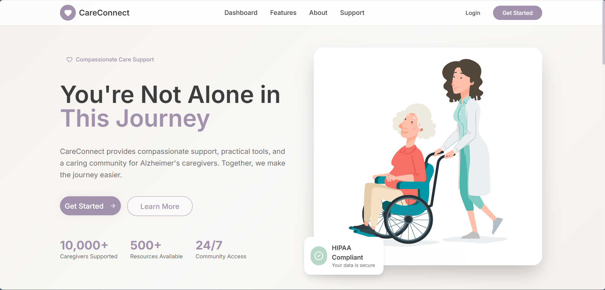
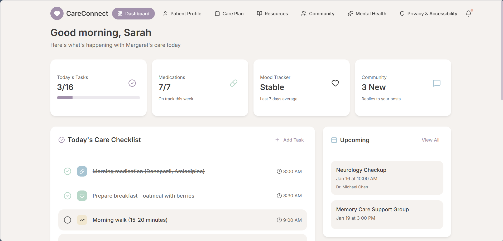
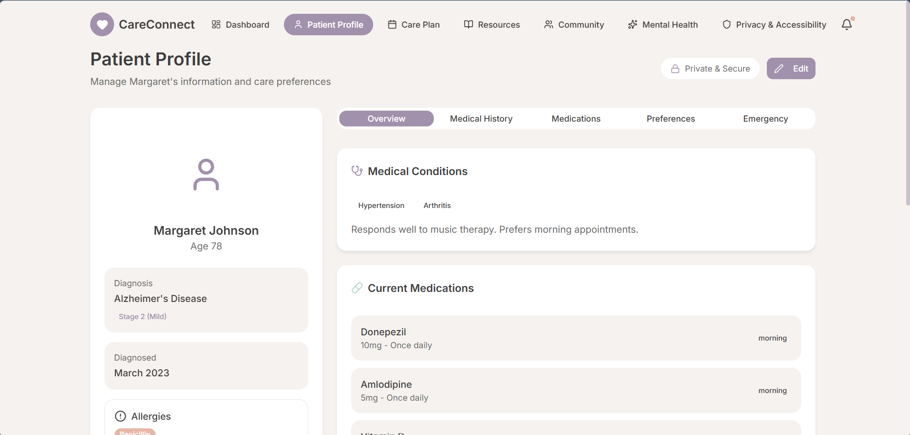
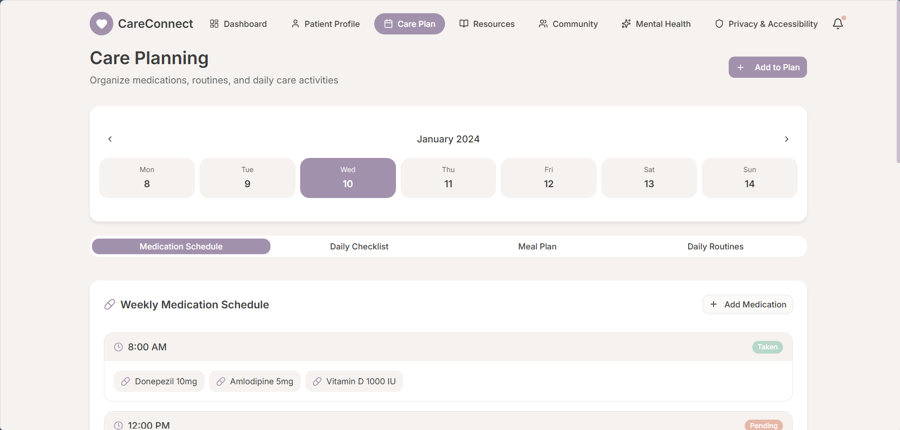
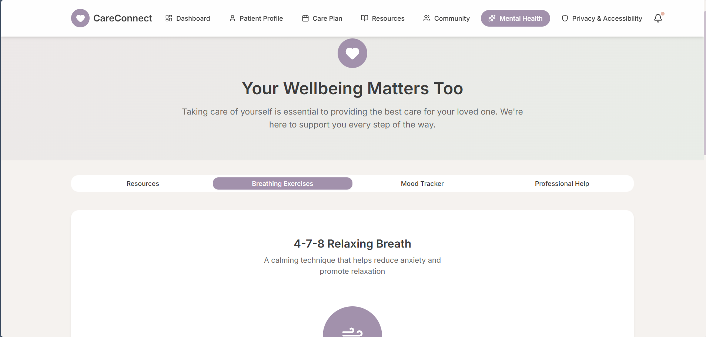

# CareConnect – Alzheimer’s Caregiver Support Platform

CareConnect is a **caregiver-first, responsive web platform** designed to support individuals caring for loved ones with Alzheimer’s disease.  
It helps caregivers manage daily care tasks, organize medical information, access reliable resources, and receive emotional support - all in one calm, easy-to-use interface.

The platform focuses on **empathy, simplicity, accessibility, and privacy**, recognizing the emotional and practical challenges caregivers face every day.

---

## 🌐 Live Demo

🔗 **Live Application**: https://careconnecting.netlify.app/
🎥 **Presentation**: https://drive.google.com/file/d/1XqomsZifc74p_ilv-t9q3twPz09Scekm/view?usp=sharing

---

## 🌟 Key Features

- **Personalized Dashboard**  
  A central overview of daily care activities, reminders, and patient status.

- **Patient Profile Management**  
  Store and manage patient details including medical history, medications, preferences, and emergency contacts.

- **Dynamic Care Plans**  
  Customizable daily routines, medication schedules, appointments, and caregiving checklists.

- **Resource Library**  
  Curated articles, guides, and tips covering Alzheimer’s stages, caregiving techniques, and self-care.

- **Community Support Forum**  
  A safe and supportive space for caregivers to share experiences, ask questions, and connect with others.

- **Mental Health & Wellness Support**  
  Caregiver-focused mental health resources, stress management tips, and emotional well-being tools.

---

## ♿ Accessibility & Inclusive Design

CareConnect is designed to be usable by caregivers of all abilities:

- High-contrast color palette
- Large, readable typography
- Simple navigation with clear labels
- Screen reader–friendly UI structure
- Minimal cognitive load for stressed users

---

## 🔐 Privacy & Data Safety

- No unnecessary personal data collection
- Sensitive medical data handled carefully
- Clear separation of patient and caregiver information
- Designed with privacy-first principles in mind  
*(Authentication and secure storage can be extended in future versions)*

---

## 🛠️ Tech Stack

- **Frontend**: React (with TypeScript)
- **Build Tool**: Vite
- **Styling**: Tailwind CSS
- **UI Components**: Radix UI & shadcn/ui
- **Icons**: Lucide React
- **Forms & Validation**: React Hook Form + Zod
- **State/Data**: Local state & mock JSON (MVP)

---

## 🚀 Getting Started

### Prerequisites

- Node.js (Latest LTS recommended)
- npm (comes with Node.js)

---

### Installation

1. Clone the repository:
   ```bash
   git clone https://github.com/suniltechs/Care_Connect.git
   cd Care_Connect
   ```

2. Install dependencies:
   ```
   npm install
   ```
### Development

Run the development server:
   ```
   npm run dev
   ```
The application will be available at:
   ```
   http://localhost:5173
   ```
### 📂 Project Structure

   ```
   src/
   ├── components/    # Reusable UI components
   ├── pages/         # Application pages (Dashboard, Care Plan, etc.)
   ├── hooks/         # Custom React hooks
   ├── lib/           # Utility functions and shared logic
   ├── data/          # Mock data and static content
   ├── types/         # TypeScript type definitions
   └── assets/        # Images and icons
   ```
### 📜 Scripts

 - npm run dev – Start development server
 - npm run build – Build the app for production
 - npm run lint – Run ESLint checks
 - npm run preview – Preview production build locally

### 📸 Screenshots

<div align="center"> 
      
      
      
     
     
</div>


### 🔮 Future Enhancements

 - Patient wandering & safety alerts
 - Multilingual language support
 - Professional counseling integration
 - Secure authentication & cloud storage
 - AI-assisted caregiving recommendations

